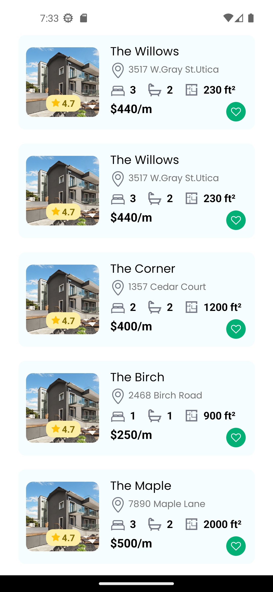

[](https://classroom.github.com/a/EKaCILZ0)


# Tole15 Real Estate Challenge

This repository contains the mobile application project for Tole15 Real Estate, developed with React Native as part of the training program at BrightCoders Institute.

## Project Description

The objective of this project is to create a mobile application for managing real estate properties. The application allows users to search, view, and publish properties available for rent or sale.

## Key Features

- Property search by location, type, price, etc.
- Detailed view of each property, including images, description, features, and relevant details.
- Intuitive and user-friendly interface.



## Technologies Used

- [React Native](https://reactnative.dev): Framework for mobile application development.
- [Expo](https://expo.dev): Platform for developing and deploying React Native applications.
- [JavaScript](https://developer.mozilla.org/en-US/docs/Web/JavaScript): Programming language used.
- Other React Native-specific packages and dependencies detailed in the `package.json` file.

## Development Environment Setup

Follow these steps to set up the development environment locally:

1. Clone this repository to your local machine:
   ```
   git clone https://github.com/BrightCoders-Institute/reto-inmobiliaria-Tole15.git
   ```

2. Ensure that you have Node.js installed on your system. Refer to the official documentation for detailed instructions on the installation.

3. Install the project dependencies by running the following command in the project's root directory:
   ```
   npm install
   ```

4. Start the application on your device/emulator using Expo:
   ```
   npm start
   ```

5. Scan the generated QR code with the Expo Go app on your mobile device or use an emulator to test the application.

## Contribution

If you want to contribute to this project, follow these steps:

1. Fork this repository and clone it to your local machine.

2. Create a new branch for your contribution:
   ```
   git checkout -b feature/new-feature
   ```

3. Make your modifications and improvements.

4. Make sure to run the existing tests and add new tests for your changes.

5. Commit your changes:
   ```
   git commit -m "Add new feature"
   ```

6. Push your changes to your remote repository:
   ```
   git push origin feature/new-feature
   ```

7. Create a pull request in this repository and describe your changes in detail.

The development team will review your request and provide feedback as soon as possible.

## Contact

If you have any questions or suggestions regarding the project, feel free to visit our collaboration space on Gather.town: [Campus Zeffo ](https://app.gather.town/app/Xqjd4OwO4fzoQAHV/campus-zeffo).

Have fun participating in the Tole15 Real Estate Challenge!
